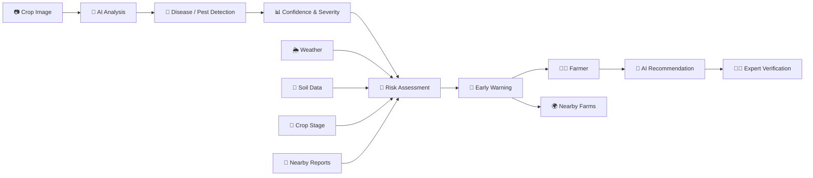

<div align="center">

# 🌱 FasalRakshak

### AI-Powered Crop Disease & Pest Early-Warning System

**Detect early. Alert nearby. Protect crops together.**

<p>
  
</p>

<p>
  <a href="https://fasalrakshak.ai.studio/">
    
  </a>
  
  
</p>

</div>

---

## 🌾 What is FasalRakshak?

**FasalRakshak** is an AI-powered agricultural intelligence platform designed to help farmers **detect crop diseases and pests early, assess crop risk, monitor farm health, and receive actionable recommendations.**

Unlike a conventional crop-disease scanner, FasalRakshak focuses on the complete cycle:

```text
📷 Detect
   ↓
🤖 Analyze
   ↓
📊 Assess Risk
   ↓
🚨 Alert Nearby
   ↓
🌱 Recommend Action
   ↓
👨‍🔬 Expert Verification
```

Our goal is to move farming from **reactive treatment → predictive crop protection.**

---

## 🎯 The Problem

Crop diseases and pest infestations can spread rapidly before farmers recognize the warning signs.

Many existing solutions primarily answer:

> **"What disease does this plant have?"**

But farmers also need to know:

* How serious is the problem?
* Could it spread?
* Which areas are at risk?
* What should I do next?
* Are nearby farms affected?
* Can an agricultural expert verify the result?

**FasalRakshak is designed to answer these questions together.**

---

# 💡 Our USP

### More than disease detection.

| Traditional Crop Scanner  | FasalRakshak                    |
| ------------------------- | ------------------------------- |
| 📷 Image scanning         | 📷 AI image analysis            |
| 🦠 Disease identification | 🦠 Disease + pest detection     |
| ❌ Mostly reactive         | 🚨 Early-warning focused        |
| ❌ Limited farm context    | 🗺️ Farm-zone intelligence      |
| ❌ Individual diagnosis    | 🌍 Community outbreak awareness |
| ❌ Basic result            | 📊 Confidence + severity + risk |
| ❌ Generic advice          | 🤖 Personalized recommendations |
| ❌ No verification         | 👨‍🔬 Expert verification       |

### FasalRakshak connects the dots.

**AI Diagnosis + Farm Intelligence + Risk Prediction + Early Alerts + Community Protection**

---

# 🚀 Key Features

### 🤖 AI Disease & Pest Detection

Upload a crop or leaf image and receive:

* Disease/pest prediction
* AI confidence score
* Severity assessment
* Risk classification
* Possible alternative diagnoses
* Recommended next steps

---

### 🗺️ Smart Farm Map

Monitor individual farm zones through an interactive map.

Each zone can display:

* Crop type
* Crop health
* Planting date
* Harvest estimate
* Temperature
* Humidity
* Soil moisture
* Risk level

High-risk areas can be visualized using **outbreak heatmaps**.

---

### 🚨 Early-Warning Alerts

FasalRakshak doesn't wait for widespread crop damage.

The platform can identify potential risks using:

```text
Crop Images
     +
Weather Conditions
     +
Soil Conditions
     +
Crop Growth Stage
     +
Historical Patterns
     +
Nearby Outbreak Reports
     ↓
AI Risk Assessment
     ↓
Early Warning
```

---

### 🌍 Community Crop Shield

One of the core differentiators of FasalRakshak.

When a potential outbreak is identified:

```text
        FARMER A
           │
      Disease detected
           ↓
       AI analysis
           ↓
      Risk assessment
           ↓
    ┌──────┴──────┐
    ↓             ↓
 FARM B         FARM C
 Alert          Alert
    ↓             ↓
 Early          Early
 inspection     inspection
```

Instead of protecting **one field**, the system aims to help protect an **entire farming community**.

> **One detected field can help protect multiple nearby fields.**

---

### 📊 Crop Health Analytics

Track:

* Plant health
* Growth trends
* Crop stages
* Maximum growth
* Minimum growth
* Average growth

Visual dashboards make complex agricultural information easier to understand.

---

### 💧 Smart Irrigation Monitoring

Monitor soil moisture and irrigation conditions.

Features include:

* Auto-watering status
* Soil moisture monitoring
* Irrigation schedule
* Watering recommendations

---

### 🧪 Soil Intelligence

Monitor:

* Nitrogen
* Phosphorus
* Potassium
* pH
* Soil moisture

Simple indicators such as:

🟢 Optimal
🟡 Moderate
🔴 Needs Attention

make the information farmer-friendly.

---

### 🤖 AI Farm Assistant

Ask questions about your farm and receive simple recommendations.

Example:

```text
Farmer:
"Should I water Area 1 today?"

AI Assistant:
"Soil moisture is currently optimal.
Continue the existing watering schedule
and reassess after the next weather update."
```

The assistant can also provide recommendations in supported regional languages.

---

### 👨‍🔬 Expert Verification

AI predictions are treated as **preliminary assessments**, not guaranteed diagnoses.

Farmers can request:

**AI Assessment → Expert Verification → Verified Recommendation**

This creates an additional layer of trust.

---

### 🌐 Multilingual & Voice Support

Designed for diverse farming communities.

Planned/available interface support includes:

* English
* Hindi
* Punjabi
* Marathi
* Bengali
* Tamil
* Telugu

Voice guidance can convert recommendations into easy-to-understand spoken instructions.

---

### 📡 Offline-Friendly

Agricultural connectivity can be unreliable.

FasalRakshak is designed around an offline-friendly experience with support for:

* Cached farm information
* Saved recommendations
* Recent alerts
* Draft scan results
* Synchronization when connectivity returns

---

# 🧠 How FasalRakshak Works



---

# 🖥️ Platform Modules

```text
FasalRakshak
│
├── 🏠 Dashboard
│
├── 🗺️ Fields Map
│
├── 📷 Disease & Pest Scan
│
├── 🚨 Risk & Outbreak Intelligence
│
├── 🔔 Alert Center
│
├── 📊 Crop Analytics
│
├── 🤖 AI Farm Assistant
│
└── ⚙️ Settings
```

---

# 📸 Product Preview

### Smart Farm Dashboard

<p align="center">
  
</p>

---

# 🛠️ Technology

The application is structured to support a modern AI-powered web architecture.

### Frontend


### AI / ML


### Platform


> Technology components may evolve as the prototype develops into a fully integrated production system.

---

# 🌱 Farmer-First Design

FasalRakshak is designed around a simple principle:

### Complex technology should produce simple decisions.

Instead of overwhelming farmers with technical data, the platform focuses on:

**What happened?**

**How serious is it?**

**What could happen next?**

**What should I do?**

**Who else should be warned?**

---

# 📈 Example Risk Levels

### 🟢 Low Risk

Crop appears healthy.

**Action:** Continue normal monitoring.

### 🟡 Medium Risk

Early warning indicators detected.

**Action:** Inspect the affected area.

### 🔴 High Risk

Strong indicators of disease/pest activity.

**Action:** Take recommended action and consider expert verification.

---

# 🎨 Product Philosophy

FasalRakshak follows four principles:

### 01 — Detect Early

Identify potential problems before visible damage becomes widespread.

### 02 — Explain Clearly

Convert AI predictions into farmer-friendly information.

### 03 — Alert Responsibly

Notify relevant nearby areas without exposing private farmer information.

### 04 — Act Together

Encourage early intervention and community-level crop protection.

---

# 🚀 Future Roadmap

* [ ] Real-time crop disease ML model
* [ ] Real-time pest detection
* [ ] IoT soil sensors
* [ ] Hyperlocal weather integration
* [ ] Satellite crop monitoring
* [ ] Advanced outbreak prediction
* [ ] Community outbreak network
* [ ] Agricultural expert network
* [ ] Full regional-language support
* [ ] Voice-first farmer assistant
* [ ] Advanced offline synchronization
* [ ] Android application
* [ ] Government/agri-department integration

---

# 🌍 Vision

Agriculture should not have to wait for a disease to become visible before taking action.

FasalRakshak aims to create a future where:

```text
One farmer detects a risk
          ↓
AI understands it
          ↓
The system predicts potential spread
          ↓
Nearby farmers are warned
          ↓
Farmers act early
          ↓
Crop losses are reduced
```

## 🌱 Detect early. Alert nearby. Protect crops together.

---

<div align="center">

### Built with 🌱 AI for smarter and more preventive agriculture.

**FasalRakshak**

[🌐 Live Demo](https://fasalrakshak.ai.studio/)

</div>
